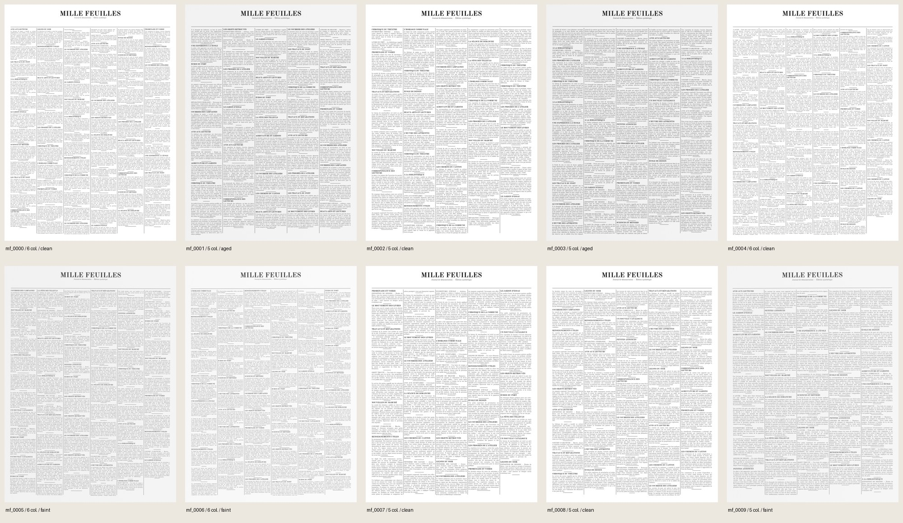

# Validation de Mille Feuilles — 0.3 et historique 0.2

## État de la version 0.3.0

**Lot 2 accepté**, sur le commit propre `4153d99` : import local multi-document,
liens exacts entre segments et blocs, génération partitionnée et rejeu filtré.
Les [preuves CLI et visuelles](reports/lot2/acceptance/index.json) complètent
la suite intégrée. Il s'agit de trois pages compactes originales, pas d'un
nouveau pilote de 100 pages ni d'une validation historique.

La suite intégrée du lot 2 passe **483 tests en 176,85 s**, Ruff et la vérification
des actifs passent. Les [sorties figées](reports/lot2/tests-index.json) conservent
aussi le premier passage (419 succès, deux échecs dus au filtre de version de
l'audit de lisibilité), corrigé sans changer les seuils de pixels. L'acceptation
CLI depuis le commit propre a passé les contrôles suivants.

- 18 documents originaux acceptés, deux documents volontairement protégés
  refusés (identifiant et 8-gramme salé). Les octets d'entrée restent inchangés.
- Trois partitions sans groupe commun, deux documents par rôle et par partition,
  tous effectivement utilisés. Une page de 800 × 1100 par partition, 4 179 mots.
- Omission de `--partition` refusée avant création de destination ; les contenus
  des autres partitions sont absents des lots filtrés.
- Rejeu de train depuis son seul lot filtré : **38 fichiers comparés identiques**,
  ainsi que le rapport QA ; une seconde reproduction séquentielle donne le PNG
  et le JSON canonique identiques. Workers 1 puis 2, environnement et code gelés.
- Les exports passent. Les 4 179 mots passent l'audit de pixels, avec contraste
  minimal 106, au moins 8 pixels d'encre, corps minimal 10 px et aucun suspect.
  Les trois pages, 18 crops et une planche géométrique sont relus visuellement.

La campagne complète occupe environ 20 Mo et reste dans
`runs/accept-partitioned-v03`. Les [résultats détaillés](reports/lot2/acceptance/acceptance.json)
et le [compte rendu visuel](reports/lot2/acceptance/visual-review.json) sont archivés.

Le [contrat 0.3](CONTRAT_DONNEES.md) conserve le profil visuel et les exigences
géométriques du pilote, et ajoute les contrôles suivants :

| Exigence 0.3 | Preuve de livraison attendue |
|---|---|
| Import local multi-document | Sources synthétiques de test explicites, octets et offsets Unicode préservés, droits et preuves copiés, refus des entrées invalides et des doublons documentaires |
| Provenance exacte | Chaque span lié à son article et à ses blocs ordonnés ; couverture unique ; mutation refusée même si un autre article contient le bon texte ; bandeau égal au `literal_text` du template |
| Groupes et partition | Groupes réels des textes utilisés, composantes réunissant les unités normalisées partagées, documents/groupes/SHA exclusifs, trois rôles par partition positive, impossibilités et limites de recherche signalées |
| Sélection explicite | Omission de `--partition` refusée si un plan existe ; aucun texte d'une autre partition embarqué dans le lot sélectionné |
| Reçu et reprise | Catalogue filtré, copie du catalogue global en métadonnées, plan et reçu identiques dans configuration/manifeste ; nouvelle génération depuis le lot filtré avec la même partition |
| Intégrité sémantique | Rejet des altérations de liens, groupes, affectations, labels et comptes de caractères, même après remise à jour des SHA-256 |
| Reproduction et exports | Petits lots multi-documents identiques avec un et deux workers ; validation des projections PAGE/ALTO/COCO et des annotations finales |
| Compatibilité | Anciens fichiers 0.2 validés selon leur contrat ; aucune conversion implicite de leurs spans ni revendication rétroactive d'isolation |

Ces critères sont couverts par la suite et l'acceptation décrites ci-dessus.
Les fixtures restent petites et répétitives : elles éprouvent les interfaces,
l'isolation déclarée et la reproduction, sans établir la représentativité du texte.

### Portée du contrôle de partition

Lors d'une première génération depuis le bundle complet, le plan est recalculé
depuis les textes vérifiés. La construction relie aussi les titres et annonces
partagés ; elle ne découpe pas aléatoirement les pages après composition. Les
poids finis et non négatifs sont des cibles relatives, avec une somme finie et
positive. La contrainte de garder les composantes entières peut éloigner les
comptes réalisés de ces cibles. Une partition positive doit contenir les trois
rôles ; une partition de poids nul doit rester vide.

Le contrôle `partition_receipt` d'un lot filtré prouve la cohérence des
métadonnées et de leurs empreintes. Sa prévalidation ne lit ni les anciennes
pages ni les textes exclus. Le contrôle `partition_characters`, dans la
validation complète, mesure les longueurs Unicode réelles des textes copiés
et les compare aux composantes sélectionnées et au total de leur partition.
Modifier ensemble les comptes du plan et leurs empreintes ne suffit donc pas
à les faire accepter. Les pages portent aussi le nom de partition du reçu.

Les comptes des composantes exclues et leurs liens par unités communes ne sont
pas recalculables depuis le lot filtré. Cette opération exige le bundle source
complet ; réutiliser son reçu ne remplace pas ce calcul. Sans reçu, le rapport
indique expressément l'absence de revendication d'isolation.

`provenance/source-catalog.json` transporte les **métadonnées globales**,
y compris identités, groupes, chemins, `source_uri` et SHA-256 des sources
dev/test ; leurs contenus textuels ne sont pas copiés. Le rapport d'import,
lorsqu'il existe, est conservé sous `provenance/import-report.json`. Sans
exclusions fournies, il doit conserver **`NOT EVALUATED`** pour la protection
externe : ni le partitionnement interne ni la copie du rapport ne démontrent
l'absence de recouvrement avec les tests Axel ou un autre corpus.
Le contrôle `import_receipt` vérifie la référence, les empreintes et la
correspondance exacte des documents acceptés avec le catalogue source global ;
il n'ouvre aucun texte exclu et ne réévalue pas les exclusions externes.

Les composantes couvrent les groupes déclarés et les unités sélectionnables
égales après NFC/réduction des espaces. Cette méthode ne constitue pas un
détecteur général de quasi-doublons. La génération tire uniformément les unités
d'un rôle : les documents contenant plus d'unités ont davantage de poids. Le
nombre de pages ne mesure donc ni la diversité des documents ni leur équilibre.

## Historique 0.2 — protocole fixé avant production

Le pilote comprend 100 pages de démonstration, 2680 × 3698 pixels à 150 dpi,
graine 20261007, colonnes tirées dans 4–6, dégradations `mixed`, deux workers.
La livraison est produite depuis un commit propre avec Python 3.12 et `uv.lock`.
Les fontes et les trois documents originaux sont ceux du catalogue embarqué.
Aucune page réelle ou donnée de test d'Axel n'est lue.

L'acceptation demande toutes les preuves suivantes :

1. Suite de tests et Ruff sans erreur, actifs vérifiés ; installation depuis un
   clone neuf du dépôt, suivie d'une génération et validation par la CLI.
2. Génération des 100 pages et audit complet : JSON, géométrie, références,
   texte, césures, provenance, licences, empreintes, images et planches QA,
   XSD PAGE/ALTO et relecture des trois exports.
3. Contrôle des pixels de chaque mot sur les PNG finaux. Seuils arrêtés avant
   le calcul : contraste fond local–pixel le plus sombre ≥ 40 niveaux sur 255,
   au moins deux pixels dont l'écart au fond est ≥ 40, police effective ≥ 10 px.
   Ces seuils détectent du contenu absent ou trop faible ; ils ne prouvent pas
   une reconnaissance humaine correcte. Les minima et suspects sont rapportés.
4. Revue visuelle de chaque page sur les dix planches de contact ; examen
   supplémentaire de contours et de recadrages à résolution native couvrant
   colonnes, dégradations, césures, ponctuation et cas les moins contrastés.
5. Reproduction séquentielle des **100 images et 100 JSON canoniques**, depuis
   le même commit, les mêmes actifs et le même environnement que le pilote
   parallèle. Comparaison des octets et SHA-256, sans réécriture des métadonnées.
   Les tests de chaîne prouvent séparément la reproduction de lots complets,
   exports et planches inclus, entre un et deux workers.
6. Archivage des preuves légères dans Git, conservation des lots locaux dans
   `runs/`, puis synchronisation du dépôt GitHub privé.

L'audit de lisibilité et la reproduction sont des preuves distinctes du `pass`
de `mille-feuilles validate`. Un fichier `qa/report.json` préexistant ne dispense
pas d'un contrôle de son contenu et de l'intégrité du lot.

## Historique 0.2 — résultats du pilote

**Pilote 0.2 accepté le 7 octobre 2026 dans le périmètre historique ci-dessus.**
Commit de production propre :
[`0d1e2b701e9f6ba4d571a5f4894bd40071792225`](https://github.com/maribakulj/mille-feuilles/tree/0d1e2b701e9f6ba4d571a5f4894bd40071792225).
Le lot est `~/heritage-synth/runs/pilot-v0.2-r2` ; sa reproduction est conservée
dans `runs/pilot-v0.2-r2-reproduction`. Les preuves légères sont copiées sans
changement dans [reports/](reports/index.json), avec leurs SHA-256.

| Exigence | Résultat mesuré | Preuve |
|---|---|---|
| Tests | **202 tests passent**, 125,68 s ; Ruff sans erreur sur `src`, `tests`, les deux outils d'acceptation et le vérificateur d'actifs | [Sortie pytest](reports/tests.txt), [commande et sortie Ruff](reports/ruff.json) |
| Installation propre | Clone GitHub neuf au commit de production, Python 3.12.13, installation verrouillée, CLI et actifs conformes ; génération puis validation réussies ; Git propre avant/après, `dirty: false` | [Rapport du clone](reports/clean-checkout.json) |
| Lot complet | **100 pages**, 2680 × 3698 px, 150 dpi ; **209 contrôles PASS**, aucun `fail` ou `not_run` | [Validation complète](reports/pilot-validation.json) |
| Volume annoté | **436 490 mots**, 65 311 lignes, 17 332 blocs, 6 808 groupes de césure | [Statistiques](reports/pilot-statistics.json) |
| Intégrité | **635 artefacts** inventoriés ; empreintes contrôlées aussi par une lecture indépendante | [Manifeste](reports/pilot-manifest.json), [audit indépendant](reports/independent-exports.json) |
| PAGE / ALTO / COCO | Tous les exports passent les contrôles du lot. Relecture XML indépendante sur 7 pages : 29 365 mots et 463 césures. COCO relu indépendamment sur les 100 images et 17 332 blocs | [Audit indépendant](reports/independent-exports.json) |
| Pixels finaux | Les **436 490 mots** sont mesurés, zéro suspect. Minima : contraste **74/255**, **10 pixels d'encre**, police effective **18 px**, contre les seuils 40, 2 et 10 | [Audit de lisibilité](reports/legibility.json) |
| Revue visuelle | Les **100 pages** vues sur les dix planches ; **150 crops** examinés et comparés aux transcriptions par trois relecteurs Codex. Pas d'anomalie bloquante observée | [Couverture et synthèse](reports/visual-summary.json), rapports individuels indexés |
| Reproduction | **100 PNG + 100 JSON**, soit **200 fichiers identiques octet pour octet** ; zéro écart ; environnement strictement identique ; rendu séquentiel comparé au pilote à deux workers | [Rapport de reproduction](reports/reproducibility.json) |

La répartition est de **7 / 33 / 60 pages à 4 / 5 / 6 colonnes**, et de
**22 `clean` / 50 `aged` / 28 `faint`**. Les deux derniers modes apportent
respectivement une légère teinte au papier et une réduction modérée du contraste.
Les classes produites sont
3 114 titres, 5 673 blocs texte, 1 489 annonces et 7 056 séparateurs. Il n'y a
aucun tableau, illustration, légende ou bloc `autre` dans ce lot.

La revue Claude relève des écarts papier–encre paramétrés de 206–229 niveaux
pour `aged` et de 158–182 pour `faint`, avec un bruit de σ = 0,55 et un flou
≤ 0,3 px. Les deux modes partagent ce bruit, ce flou et une rotation légère
(au plus 0,34° observé). Ces écarts de paramètres sont distincts du contraste local mesuré
dans les pixels des mots. Le minimum observé de 74 reste au-dessus du seuil
de 40 : le pilote n'éprouve pas la lisibilité aux limites de ce seuil ni une
presse fortement dégradée.

L'environnement mesuré est macOS 26.4.1 arm64, CPython 3.12.13, FreeType 2.14.3,
Pillow 12.3.0 et moteur BASIC. Les autres versions et empreintes des sources
figurent dans [environment.json](reports/environment.json). L'empreinte du
manifeste de production est
`7c512bdeec4ffa71cc2346f69a073f7f2e4be3f30dafbf6ee7445602d0e6eb71`.

Les planches montrent des marges et gouttières conservées ; les pieds de colonnes
sont volontairement inégaux car un article n'est pas coupé en fin de page.
Les contours de `mf_0029` et le PNG de `mf_0036` ont aussi été examinés directement.
Les crops à ×2 nearest conservent accents, ponctuation et césures ; quelques
fragments voisins apparaissent dans leurs marges sans masquer la cible.
Cette lecture des échantillons ne certifie pas chaque mot du lot ni la lecture
humaine en aveugle à l'échelle native.



## Historique 0.2 — boucle de correction réellement exercée

La première campagne `runs/pilot-v0.2`, conservée pour diagnostic, a échoué sur
le filet `mf_0029_b0126` : son épaisseur de 1 px permettait la fusion de deux
sommets après rotation et arrondi PAGE. Les filets sont maintenant d'au moins
2 px, dans l'image et le canonique, et le cas exact est un test de régression.
Le contrôle des polygones dégénérés n'a pas été affaibli. L'audit indépendant
confirme les quatre sommets distincts du filet corrigé et contrôle 476 filets
sur les sept pages XML relues.

Une erreur annule désormais les pages encore en attente et laisse finir les
tâches actives avant de remonter l'erreur initiale ; la concurrence et la
préservation de cette erreur sont testées. Le second pilote a été intégralement
produit et contrôlé après ces corrections. Aucun lot n'a été déplacé ou supprimé.

## Historique 0.2 — vérification et reproduction

### Contrôle supplémentaire après la revue Claude

La [revue réciproque](REVUE_CLAUDE.md) de la version 0.2, le même jour, a ajouté un contrôle
d'occurrence des segments sources dans le texte composé, avec 24 tests écrits
par Claude et un test de raccordement écrit par Codex. Après leurs relectures
mutuelles, la suite complète passe **227 tests en 143,60 s**, et Ruff ne signale
aucune erreur. La revalidation en lecture du pilote conservé passe à nouveau
les **209 contrôles**, dont le nouveau contrôle de provenance inclus dans les
contrôles de fichiers de chaque page.

Les [preuves complémentaires](reports/claude-review/index.json) identifient
les sources relues, les commandes, leurs sorties et leurs empreintes. Les
19 preuves initiales restent inchangées : les 202 tests du tableau précédent
décrivent le commit de production du pilote. Lors de cette revue complémentaire,
le moteur de rendu, les exporteurs, les actifs et les schémas étaient inchangés
par rapport à cette production ; les pages n'ont pas été régénérées.
Les **227 tests** décrivent cette étape historique, pas la suite actuelle 0.3.
La reproduction initiale de 200 fichiers reste celle de son commit source.

### Reproduire le protocole initial

Depuis un checkout du commit de production
`0d1e2b701e9f6ba4d571a5f4894bd40071792225` et son environnement verrouillé, choisir des
destinations neuves (les chemins ci-dessous existent déjà sur la machine de
mesure) :

```sh
uv sync --locked --python 3.12
uv run --locked pytest -q
uv run --locked ruff check src tests assets/verify_assets.py tools/audit_legibility.py tools/reproduce_pilot.py
uv run --locked python assets/verify_assets.py
uv run --locked mille-feuilles generate --output runs/pilot-v0.2-r2 --pages 100 --seed 20261007 --jobs 2
uv run --locked mille-feuilles validate runs/pilot-v0.2-r2
uv run --locked python tools/audit_legibility.py runs/pilot-v0.2-r2 --report runs/pilot-v0.2-r2-legibility.json --samples-dir runs/pilot-v0.2-r2-word-samples
uv run --locked python tools/reproduce_pilot.py runs/pilot-v0.2-r2 --output runs/pilot-v0.2-r2-reproduction --report runs/pilot-v0.2-r2-reproduction.json
```

Ces commandes de reproduction 0.2 ne doivent pas être exécutées depuis le
moteur courant 0.3 pour revendiquer les mêmes octets. Lire et valider l'ancien
contrat reste possible ; sa régénération identique exige son code de production.

La génération appelle déjà la validation complète ; la commande `validate`
permet de la recalculer après transport. Les rapports archivés décrivent cette
exécution, avec ses chemins locaux ; le répertoire `docs/reports` n'est pas un
lot de données. Le script indépendant est conservé tel qu'exécuté depuis `runs/`,
à côté du lot `pilot-v0.2-r2` et de son journal de progression ; les commandes
générales réutilisables sont celles ci-dessus.

## Limites d'interprétation du pilote historique 0.2

Les textes sont originaux, synthétiques et répétés : les 100 pages ne sont pas
100 sources indépendantes. Les trois documents partagent un groupe de source,
et les pages réutilisent corps, titres et annonces : ce lot ne fournit pas trois
partitions indépendantes. Il ne possède aucun reçu de partition 0.3. Le pilote ne démontre pas la diversité
lexicale, la représentativité historique ou un gain de modèle sur des données
réelles. Aucun entraînement n'est lancé.

La production couvre titres, corps, annonces et filets. Tableaux, illustrations,
lettrines, verso/transparence, déformations non affines et scripts complexes sont
absents. Les dégradations sont légères et les fontes limitées à Old Standard
Regular/Bold dans ce profil. Le moteur de composition BASIC est explicite ; les
ligatures OpenType discrétionnaires ne sont pas activées.
Les césures suivent la largeur de composition, sans dictionnaire syllabique ;
les contrôles garantissent leur reconstruction, pas leur qualité linguistique.

Les exports sont validés selon nos profils documentés ; une lecture directe
avec le lecteur NewsEye d'Axel perd titres, articles et rang des annonces
sur la page testée `mf_0003`. L'adaptateur aval reste nécessaire et absent.
La conformité XSD et la relecture interne ne prouvent pas la compatibilité avec
ce lecteur. Voir la [reproduction de cette limite](EXPORTS.md#lecture-par-axel--adaptateur-encore-nécessaire).

Le fonctionnement validé est celui d'un checkout du dépôt avec l'environnement
verrouillé. La reproduction bit à bit sur un autre système ou avec une autre
version de FreeType/Pillow n'est pas revendiquée.
